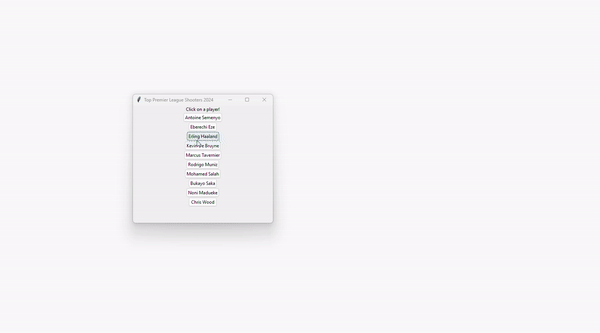

# Premier-League-Shots-Heatmap
This is a small project to better understand using tkinter to create a GUI for python.
When this project is completed the user will be able to create nice graphs to visualize Premier League shots.

