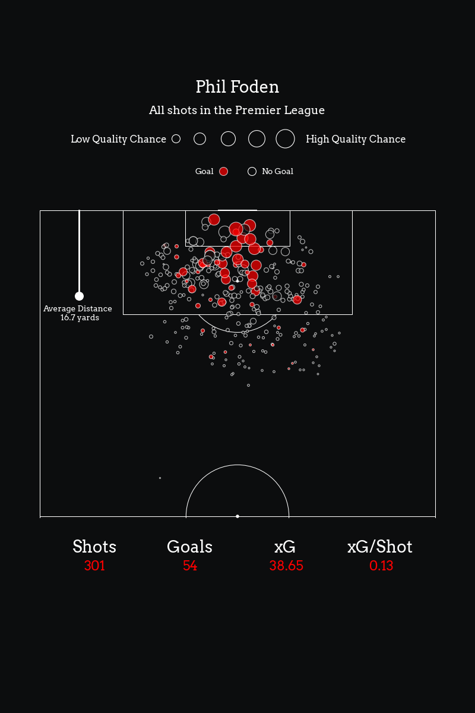
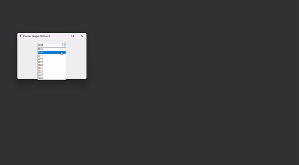

# Premier-League-Shots-Heatmap

This is a small project to better understand using tkinter to create a GUI for python.
When this project is completed the user will be able to create nice graphs to visualize Premier League shots.

I have created a simple GUI for the user to select which year they would like to look at and they can cycle through the top 10 players:

